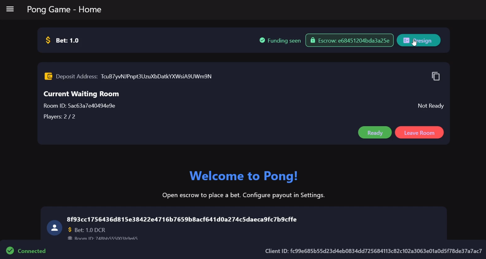

# Pong on Bison Relay

A fast, privacy-friendly Pong with self custodial bets, built on the Bison Relay network.

**Self‑custodial** with **Schnorr adaptor signatures**. You fund your own escrow pkscript, bet and play.



---

## Why this is different

- **Self‑custodial escrow** – You fund a **script you control** (P2SH). The server never holds your funds.
- **Schnorr adaptor settlement** – Matches resolve by revealing a secret embedded in a final Schnorr signature, unlocking the winner’s payout without giving custody to anyone in the middle.
- **Safety valve (CSV timeout)** – If settlement stalls, the redeem script includes a **CSV** (relative timelock) refund path so you can reclaim funds.
- **Privacy by design** – Bison Relay RPC authentication with payment and messages over an end‑to‑end, censorship‑resistant network.

---

## Feature Highlights

- 🏓 Real‑time Pong (Terminal UI with Bubble Tea, or Flutter UI)
- 💸 Escrow‑backed betting in DCR
- 🎯 Waiting rooms & matchmaking by stake
- 🔔 In‑app notifications

---

## How it works (plain English)

1. **Create your self‑escrow.** The client derives a redeem script from **your public key** and safety params (e.g., **CSV** blocks). It shows a **script address (P2SH)** for you to fund.
2. **Fund it.** Send DCR to that address. The bot sees your funding tx (mempool or after N confirms—policy dependent) and marks your escrow “ready.”
3. **Join or create a waiting room.** Rooms are grouped by the **stake** available in your escrow.
4. **Play the match.** First to 3 points wins.
5. **Settlement via Schnorr adaptor.** The winner learns a secret (γ) from the final signature and uses it to unlock the payout from the escrow script.
6. **Timeout fallback.** If something goes wrong, you can reclaim funds after the CSV timeout with your own key.

> **Self‑custody note:** If you see a “deposit address,” it’s a **script address you control**. The server cannot move your funds. The script is constructed from **your** key and rules you can verify.

---

## Quick Start

### Prerequisites
- Go 1.22+
- Bison Relay client running with RPC enabled (brclient or bruig)
- (Optional) Flutter if you want the GUI

### Build

**Bot (referee & API)**
```bash
go build -o pongbot ./cmd/pongbot
```

**Terminal Client**
```bash
go build -o pongclient ./cmd/pongclient
```

**Flutter UI**
```bash
cd pongui
# See detailed steps in pongui/README.md
```

### Run

**Start the server (bot):**
```bash
./pongbot
```

**Start the terminal client:**
```bash
./pongclient
```

**Start the Flutter UI:**
```bash
cd pongui
# run via Flutter tooling (see pongui/README.md)
```

---

## Minimal Configuration

Your Bison Relay RPC must be enabled and reachable. On first run, each component creates a config file with defaults that you can edit.

- **Bot config:** `{appdata}/.pongbot/pongbot.conf`  
- **Terminal client config:** `{appdata}/.pongclient/pongclient.conf`  
- **Flutter client config:** `{appdata}/.pongui/pongui.conf`

<details>
  <summary>Example BR RPC (clientrpc) config</summary>

```ini
[clientrpc]
jsonrpclisten = 127.0.0.1:7676
rpccertpath = /home/{user}/.brclient/rpc.cert
rpckeypath = /home/{user}/.brclient/rpc.key
rpcuser = your_user
rpcpass = your_pass
rpcauthmode = basic
rpcclientcapath = /home/{user}/.brclient/rpc-ca.cert
rpcissueclientcert = 1
```
</details>

<details>
  <summary>Example bot config</summary>

```ini
datadir=/home/{user}/.pongbot
isf2p=false
minbetamt=0.00000001
rpcurl=wss://127.0.0.1:7676/ws
grpchost=localhost
grpcport=50051
httpport=8888
servercertpath=/home/{user}/.brclient/rpc.cert
clientcertpath=/home/{user}/.brclient/rpc-client.cert
clientkeypath=/home/{user}/.brclient/rpc-client.key
rpcuser=your_user
rpcpass=your_pass
debug=debug
```
</details>

<details>
  <summary>Example terminal client config</summary>

```ini
serveraddr=localhost:50051
rpcurl=wss://127.0.0.1:7676/ws
servercertpath=/home/{user}/.brclient/rpc.cert
clientcertpath=/home/{user}/.brclient/rpc-client.cert
clientkeypath=/home/{user}/.brclient/rpc-client.key
grpcservercert=/home/{user}/server.cert
rpcuser=your_user
rpcpass=your_pass
```
</details>

<details>
  <summary>Example Flutter client config</summary>

```ini
serveraddr={server_ip_or_localhost}:50051
rpcurl=wss://127.0.0.1:7676/ws
servercertpath=/home/{user}/.brclient/rpc.cert
clientcertpath=/home/{user}/.brclient/rpc-client.cert
clientkeypath=/home/{user}/.brclient/rpc-client.key
grpcservercert=/home/{user}/server.cert
rpcuser=your_user
rpcpass=your_pass
```
</details>

---

## Funding your self‑escrow (what you’ll see)

1. Client shows a **script address (P2SH)**.  
2. You **send DCR** to it (any wallet).  
3. Bot detects your funding tx and marks your escrow as **available stake**.  
4. You can now **enter rooms** that match your available stake.

> The redeem script: **P2SH(pk, CSV)** — spend path (winner via adaptor‑revealed secret) and a **refund path** after CSV with your own key.

---

## Gameplay

1. Fund your escrow pkscript (above).
2. Create or join a waiting room that matches your available stake.
3. Ready up. When both players are ready, the match starts.
4. Controls: **W/S** or **↑/↓**.
5. First to **3** points wins. Winner unlocks the escrow payout.

---

## Betting & Safety

- **Minimum Stake:** set by the bot (`minbetamt`, default `0.00000001 DCR`).  
- **Free‑to‑Play:** `isf2p=true` uses simulated escrows for testing.  
- **CSV Timeout:** protects you if settlement is delayed; you can refund after the relative timelock.  
- **Connectivity:** confirm your Bison Relay client is connected before playing.

---

## Dev Notes

- **gRPC API:** see [`pongrpc/README.md`](pongrpc/README.md)  
- **Flutter UI:** see [`pongui/README.md`](pongui/README.md)

---

## FAQ

**If funds are self‑custodial, why do I see a “deposit address”?**  
That’s a **script address you control** (P2SH). The redeem script is built from **your** public key and safety parameters (like a **CSV** timeout). It’s not a server wallet.

**How does Schnorr adaptor settlement work here?**  
Before the match, the protocol prepares signatures so that the final winner’s signature **reveals a secret (γ)**. Knowing γ lets the winner satisfy the script’s spend path and unlock the payout—**without** giving the server custody of anyone’s funds.
You can see more about it [here](https://victorduarte.site/blog/schnorr/)

**What if settlement fails?**  
Wait the configured **CSV** period, then use the refund path with your key to reclaim your funds.

---
